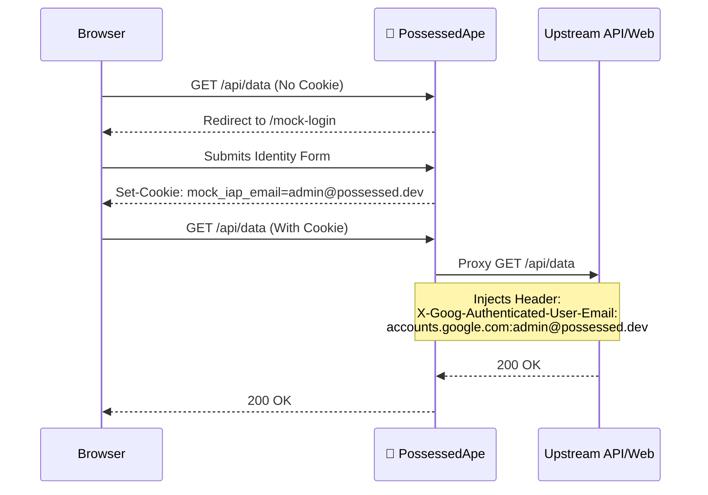

<div align="center">
  
  # 🦍 PossessedApe

  <p><b>Authentication Proxy Emulator</b> — <i>Hack into your local dev environment without the friction.</i></p>

  [](https://caddyserver.com/)
  [](#)
</div>

<br/>

PossessedApe is a lightweight, ultra-fast Caddy-based reverse proxy that intercepts your local traffic and injects mock authentication headers. Perfect for simulating Google Cloud Identity-Aware Proxy (IAP) or other authenticated environments on your local machine.

Stop fighting with real auth tokens during development. Just spin up the Ape, assume an identity, and get back to building.

## ✨ Features

- 🚀 **Zero-Friction Local Dev**: Bypass complex OAuth flows when you just need to test your backend endpoints.
- 🎨 **Cyberpunk Login UI**: A slick, dark-mode terminal-inspired intercept page customized with scanlines, CRT flickers, and neon vibes. 
- 🪪 **Identity Spoofing**: Seamlessly maps your selected mock identity to `X-Goog-Authenticated-User-Email` headers on the fly.
- 💾 **Profile Management**: Built-in `localStorage` profile manager. Save and switch between different user personas (Admin, Standard, Guest) with a single click.
- ⚡ **Caddy Powered**: Blazing fast routing and reverse proxy configurations.

---

## 🛠 How it Works

PossessedApe sits in front of your local services. If it detects you are missing the `mock_iap_email` cookie, it ruthlessly intercepts your request and redirects you to the `/mock-login` interface.

Once you "ASSUME IDENTITY", it drops the cookie into your browser and proxies all subsequent requests directly to your upstream services, injecting the proper authentication headers that your backend expects.



## ⚙️ Configuration

The entire routing engine is powered by a ridiculously simple `Caddyfile`.

### Environment Variables
You need to provide the target upstream URLs to the container:
- `PORT` (default: `8080`)
- `UPSTREAM_API_URL` (e.g., `http://localhost:8082`)
- `UPSTREAM_FEEDBACK_URL` (e.g., `http://localhost:3001`)
- `UPSTREAM_WEB_URL` (e.g., `http://localhost:5173`)

### Modifying the Aesthetics
Want to customize the intercept page? The entire UI is bundled into a self-contained `login.html` file using TailwindCSS via CDN. No build steps. No `node_modules` black holes. Just open `login.html` and start tweaking the `tailwind.config` in the `<head>`.

## 🚀 Getting Started

Deploy it as part of your local Docker Compose or Kubernetes cluster. 

```yaml
# Example docker-compose.yml snippet
services:
  possessed_ape:
    image: caddy:alpine
    ports:
      - "8080:8080"
    volumes:
      - ./Caddyfile:/etc/caddy/Caddyfile
      - ./login.html:/www/login.html
      - ./possessed_ape.png:/www/assets/possessed_ape.png
    environment:
      - UPSTREAM_API_URL=http://backend:8082
      - UPSTREAM_WEB_URL=http://frontend:5173
```

> **Warning**  
> PossessedApe is strictly for **local development and testing**. Never run this proxy emulator in a production environment unless you intentionally want anyone to bypass your authentication layer!
